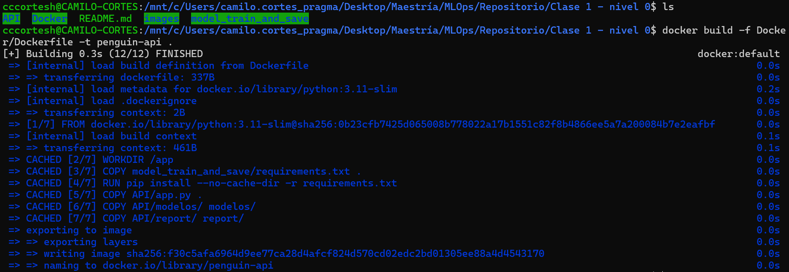
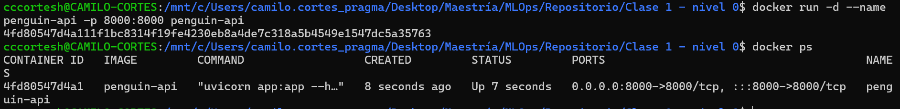

# 🐧 Penguin Classifier API

API de clasificación de especies de pingüinos usando Machine Learning y FastAPI, desplegada en un contenedor Docker.

## Tabla de Contenidos

- [Descripción General](#descripción-general)
- [1. Entrenamiento del Modelo](#1-entrenamiento-del-modelo)
- [2. Desarrollo de la API](#2-desarrollo-de-la-api)
- [3. Contenerización con Docker](#3-contenerización-con-docker)
- [4. Pruebas del Despliegue](#4-pruebas-del-despliegue)

---

## Descripción General

Este proyecto implementa un pipeline completo de MLOps que va desde el entrenamiento de un modelo de clasificación de pingüinos hasta su despliegue como API REST dentro de un contenedor Docker.

**Especies clasificadas:**
| ID | Especie   |
|----|-----------|
| 1  | Adelie    |
| 2  | Chinstrap |
| 3  | Gentoo    |

---

## 1. Entrenamiento del Modelo

El modelo fue entrenado usando el notebook `train.ipynb` con el dataset `penguins_v1.csv`.

### Proceso de entrenamiento

1. Carga y exploración del dataset de pingüinos
2. Preprocesamiento y limpieza de datos
3. Feature engineering (se crearon variables como `bill_ratio` y `body_mass_kg`)
4. Escalado de features con `StandardScaler`
5. Entrenamiento del modelo de clasificación
6. Exportación del modelo (`penguin_classifier_model.pkl`) y el scaler (`penguin_scaler.pkl`) con `joblib`

<!-- Agregar imagen del entrenamiento -->


<!-- Agregar imagen de métricas / matriz de confusión -->


### Features del modelo

| Feature            | Tipo  | Descripción                          |
|--------------------|-------|--------------------------------------|
| `island`           | int   | Isla (0: Biscoe, 1: Dream, 2: Torgersen) |
| `bill_length_mm`   | float | Largo del pico en mm                 |
| `bill_depth_mm`    | float | Profundidad del pico en mm           |
| `flipper_length_mm`| int   | Largo de la aleta en mm              |
| `body_mass_g`      | int   | Masa corporal en gramos              |
| `sex`              | int   | Sexo (0: female, 1: male)            |
| `year`             | int   | Año de observación                   |
| `bill_ratio`       | float | Ratio largo/profundidad del pico (calculado) |
| `body_mass_kg`     | float | Masa corporal en kg (calculado)      |

---

## 2. Desarrollo de la API

La API fue construida con **FastAPI** y expone los siguientes endpoints:

### `GET /health`
Health check para verificar que el servicio está activo.

```json
// Response 200
{"status": "ok"}
```

### `POST /predict`
Recibe las características de un pingüino y devuelve la especie predicha.

**Request body:**
```json
{
  "island": 0,
  "bill_length_mm": 39.1,
  "bill_depth_mm": 18.7,
  "flipper_length_mm": 181,
  "body_mass_g": 3750,
  "sex": 1,
  "year": 2007
}
```

**Response 200:**
```json
{
  "species_id": 1,
  "species_name": "Adelie"
}
```

### Manejo de errores

La API incluye validaciones y excepciones HTTP:

- **422 Unprocessable Entity**: Datos de entrada inválidos (island fuera de rango, sex inválido, bill_depth_mm = 0)
- **500 Internal Server Error**: Error interno durante la predicción
- **404 Not Found**: Especie no encontrada en el mapeo

**Ejemplo de error 422:**
```json
{
  "detail": [
    {
      "type": "value_error",
      "loc": ["body", "island"],
      "msg": "Value error, island debe ser 0 (Biscoe), 1 (Dream) o 2 (Torgersen)"
    }
  ]
}
```

<!-- Agregar imagen de la documentación Swagger -->


---

## 3. Contenerización con Docker

### Dockerfile

```dockerfile
FROM python:3.11-slim

WORKDIR /app

COPY requirements.txt .
RUN pip install --no-cache-dir -r requirements.txt

COPY penguin_classifier_model.pkl .
COPY penguin_scaler.pkl .
COPY app.py .

EXPOSE 8000

CMD ["uvicorn", "app:app", "--host", "0.0.0.0", "--port", "8000"]
```

### Construcción de la imagen

```bash
docker build -t penguin-classifier .
```

<!-- Agregar imagen del build de Docker -->


### Ejecución del contenedor

```bash
docker run -d --name penguin-api -p 8000:8000 penguin-classifier
```

<!-- Agregar imagen del contenedor corriendo -->


---

## 4. Pruebas del Despliegue

### Health Check

```bash
curl http://localhost:8000/health
```
```json
{"status": "ok"}
```

<!-- Agregar imagen del health check -->


### Predicción exitosa

```bash
curl -X POST http://localhost:8000/predict \
  -H "Content-Type: application/json" \
  -d '{"island":0,"bill_length_mm":39.1,"bill_depth_mm":18.7,"flipper_length_mm":181,"body_mass_g":3750,"sex":1,"year":2007}'
```
```json
{"species_id": 1, "species_name": "Adelie"}
```

<!-- Agregar imagen de predicción exitosa -->


### Validación de errores

```bash
curl -X POST http://localhost:8000/predict \
  -H "Content-Type: application/json" \
  -d '{"island":5,"bill_length_mm":39.1,"bill_depth_mm":0,"flipper_length_mm":181,"body_mass_g":3750,"sex":3,"year":2007}'
```

<!-- Agregar imagen de validación de errores -->


### Documentación interactiva

FastAPI genera documentación automática disponible en:

- **Swagger UI**: [http://localhost:8000/docs](http://localhost:8000/docs)
- **ReDoc**: [http://localhost:8000/redoc](http://localhost:8000/redoc)

<!-- Agregar imagen de la documentación -->


---

## Estructura del Proyecto

```
├── app.py                        # API FastAPI
├── train.ipynb                   # Notebook de entrenamiento
├── penguins_v1.csv               # Dataset
├── penguin_classifier_model.pkl  # Modelo entrenado
├── penguin_scaler.pkl            # Scaler
├── requirements.txt              # Dependencias Python
├── Dockerfile                    # Configuración del contenedor
├── README.md                     # Este archivo
└── images/                       # Capturas de pantalla
    ├── entrenamiento.png
    ├── metricas.png
    ├── swagger.png
    ├── docker_build.png
    ├── docker_run.png
    ├── health_check.png
    ├── prediccion_ok.png
    ├── validacion_errores.png
    └── docs.png
```
